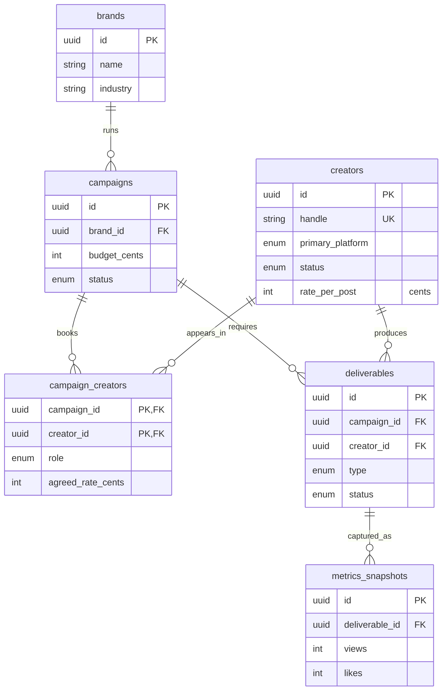

# Nexus Entity-Relationship Diagram

```mermaid
erDiagram
    brands              ||--o{ campaigns          : "runs"
    campaigns           ||--o{ campaign_creators   : "books"
    creators            ||--o{ campaign_creators   : "appears_in"
    campaigns           ||--o{ deliverables        : "requires"
    creators            ||--o{ deliverables        : "produces"
    deliverables        ||--o{ metrics_snapshots   : "captured_as"

    brands {
      uuid   id PK
      string name
      string industry
    }
    creators {
      uuid   id PK
      string handle UK
      enum   primary_platform
      enum   status
      int    rate_per_post "cents"
    }
    campaigns {
      uuid   id PK
      uuid   brand_id FK
      int    budget_cents
      enum   status
    }
    campaign_creators {
      uuid   campaign_id PK,FK
      uuid   creator_id  PK,FK
      enum   role
      int    agreed_rate_cents
    }
    deliverables {
      uuid   id PK
      uuid   campaign_id FK
      uuid   creator_id  FK
      enum   type
      enum   status
    }
    metrics_snapshots {
      uuid   id PK
      uuid   deliverable_id FK
      int    views
      int    likes
    }
```
