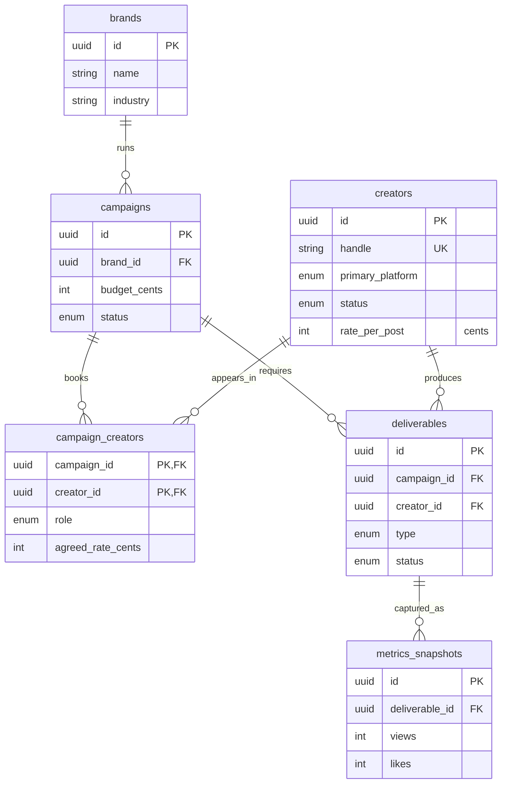

# Phase 1 Guide — Schema & Mock Data
**Companion to:** CMSC 4XX Project Guidelines (§5 Data Model, §7 Phase 1, §8 Standards)
**Follows:** `001-setup-skeleton.md` (Phase 0)
**Goal:** Turn the one-row placeholder seed into a **deterministic, faker-generated dataset** big enough that the Phase 3 charts look real — ≥50 creators, ≥10 brands, ≥15 campaigns, ≥100 deliverables, ≥1,000 metrics snapshots across 90 simulated days — plus the one schema field Phase 0 left open (`role`), an ER diagram, and ADR-002.
**Estimated time:** 3–5 hours. Getting the metrics curves to *look* realistic is where the extra hour goes.

> **How to use this guide:** same rules as Phase 0 — type it, don't paste, and read every `# WHY:`. Phase 1 is mostly one big file (the seed), and the whole point is that you can defend *why the fake data is shaped the way it is* in your demo. "Faker made it" is the §9 ownership failure all over again.

---

## 0. Where Phase 0 left you

| You already have (Phase 0) | Phase 1 changes it to |
|---|---|
| `schema.prisma` with 8 models, all §5 enums | + `CampaignRole` enum, + `role` on `campaign_creators` (migration #2) |
| `seed.ts` that upserts **one** demo creator | a faker generator producing the full §7 volumes |
| `db:seed` / `db:reset` scripts + seed wired in `prisma.config.ts` | unchanged — you just replace the seed *body* |
| `health.test.ts` smoke test | + a `db:verify` invariant gate (complements it) |
| `work-tasks/adr/NEXUS-1.md` (ADR-001 — **currently empty, fill it**) | + `work-tasks/adr/NEXUS-2.md` (ADR-002), + `docs/erd.md` |

**Prerequisite:** your Phase 0 exit checklist is green (`docker compose up -d` → `npm install` → `npm run db:migrate && npm run db:seed` → `npm run dev` works). If the DB isn't up, `docker compose up -d` first. Two specifics carried over from your Phase 0: Postgres is mapped to host **5433** (not the guide's 5432), and every command below reads `DATABASE_URL` from `apps/api/.env`.

> **Reconciled for your actual Phase 0 stack.** I updated this guide after reviewing your repo, so it matches what you built rather than the guide's older assumptions: **Prisma 6** with `prisma.config.ts` (not the old `package.json` `"prisma": { "seed" }` key), ESM + `"type": "module"`, host port **5433**, and ADRs under `work-tasks/adr/`. The change that matters most is in §5/§6 — on Prisma 6, `.env` is **not** auto-loaded for scripts, so the seed and verify files below start with `import 'dotenv/config'`. Drop it and you get a `DATABASE_URL not found` / "can't reach database" crash before anything runs.

---

## 1. Close the schema gap — `role` on `campaign_creators`

§5 specifies `campaign_creators.role (enum)`, but the Phase 0 skeleton left it off. We add it now, as its **own** migration. Two reasons: it's the last piece of "all §5 migrations," and performing a real enum-adding migration is exactly the concrete experience ADR-002 documents.

Add the enum and the field to **`apps/api/prisma/schema.prisma`**:

```prisma
enum CampaignRole {
  PRIMARY      // the hero/headline creator for the campaign
  SUPPORTING   // additional reach around the primary
  AFFILIATE    // performance/commission-oriented placement
}
```

Update the `CampaignCreator` model (the rest stays as it was in Phase 0):

```prisma
model CampaignCreator {
  campaignId      String
  creatorId       String
  agreedRateCents Int
  role            CampaignRole @default(SUPPORTING)   // <-- new

  campaign        Campaign     @relation(fields: [campaignId], references: [id])
  creator         Creator      @relation(fields: [creatorId], references: [id])

  @@id([campaignId, creatorId])
  @@index([creatorId])
  @@map("campaign_creators")
}
```

> **WHY `@default(SUPPORTING)`:** adding a **non-null** column to an existing table needs a value for any rows already there. The default backfills them, so the migration is safe and non-breaking. (Your `campaign_creators` table is empty right now, so it's doubly safe — but the *habit* of "new required column ⇒ give it a default" is the transferable lesson, and it's half of ADR-002.)

Generate and apply migration #2:

```bash
cd apps/api
npx prisma migrate dev --name add_campaign_role
```

> **WHY a brand-new enum is fine in one migration:** Postgres only gets fussy when you `ALTER TYPE ... ADD VALUE` to an *existing* enum and then use that value in the *same* transaction. Here you're doing `CREATE TYPE` + `ADD COLUMN` — no such conflict. The fussy case is what ADR-002 §Consequences plans for.

Confirm in Adminer (http://localhost:8080) that `campaign_creators` now has a `role` column.

---

## 2. Mirror the enum in `shared-types` (Engineering Standard #3)

The frontend imports enums from `@nexus/shared-types` rather than redeclaring them. Keep it the single source of truth — add `CampaignRole` to **`packages/shared-types/src/index.ts`**:

```ts
export type CampaignRole = 'PRIMARY' | 'SUPPORTING' | 'AFFILIATE';
```

> **WHY duplicate it here at all:** Prisma's generated enum lives in `@prisma/client`, which is a **backend** dependency — the Angular app must never import it. `shared-types` is the neutral ground both sides can import. In Phase 4 you can add a tiny CI check that these two lists haven't drifted; for now, changing them together is the discipline.

---

## 3. Install faker

```bash
cd apps/api
npm i -D @faker-js/faker
```

> Given your track record you'll pull the newest **@faker-js/faker** (v9 or v10). The seed below deliberately steers around the APIs that churned across those majors — it uses `faker.number.int` (never `faker.number.float`, whose `precision`→`fractionDigits` rename tripped people) and builds handles from `faker.person.*` rather than the renamed `faker.internet.userName()`/`username()`. So it runs unchanged whichever major you land on.

---

## 4. Design the dataset (read this before writing code)

Three properties matter, and they're in tension:

**1. Realistic volume (§7).** The floors — ≥50 creators, ≥10 brands, ≥15 campaigns, ≥100 deliverables, ≥1,000 snapshots, 2–3 insights — exist so the Phase 3 charts have something to draw. We'll overshoot them so a low-variance run still clears the bar.

**2. Deterministic (§7: "fixed faker seed").** `faker.seed(42)` makes every faker call reproducible **as long as the calls happen in the same order every run.** So: no `Promise.all` over faker calls, no unordered `Set`/`Map` iteration during generation. Generate the whole graph sequentially into arrays first; insert afterward.

> **WHY generate ids with `faker.string.uuid()` instead of `crypto.randomUUID()`:** `faker.string.uuid()` is driven by the seeded PRNG, so the surrogate keys come out **identical every run too.** That's what makes `npm run db:reset` produce a byte-for-byte identical database — not just "same shape, different ids." It also means a Phase 2 integration test *could* hardcode a known id if it wanted to. `crypto.randomUUID()` is unseeded and would break that.

**3. Anchored in time.** Metrics must span "90 simulated days." If you anchor to `new Date()`, that window slides forward every day you run the seed — charts shift, and any date-based test becomes flaky by tomorrow.

> **WHY a fixed `SIM_END` constant:** pin the simulation's "now" to a literal date. The 90-day window, campaign schedules, due dates, and metric timelines all derive from it, so the dataset is stable across machines and across calendar days. This is the single most common determinism bug in seed scripts.

**Shape of the metrics.** Real social metrics are *cumulative and saturating* — fast growth right after posting, then a plateau — not random noise. We model each posted deliverable's view count as `finalViews · (1 − e^(−k·t))` and derive likes/comments/shares/watch-time as fixed ratios of views. Because views only ever climbs and the ratios are constant per deliverable, **every series is monotonically non-decreasing** — which the `db:verify` script checks, and which is exactly what makes a line chart look like growth instead of static.

**Idempotency.** The seed deletes all rows (in FK-safe order) before generating. Run it twice back-to-back → same DB (idempotent). `db:reset` drops and recreates the schema, reapplies migrations, then auto-runs this seed → same DB every time (deterministic). Belt and suspenders.

---

## 5. The seed generator

Replace the entire body of **`apps/api/prisma/seed.ts`** with the following. The knobs at the top are tuned to overshoot the §7 floors; the `db:verify` script (§6) enforces them, so bump these if a run ever comes up short.

```ts
import 'dotenv/config'; // WHY: Prisma 6 does NOT auto-load .env. Running this via
                        // `tsx prisma/seed.ts` (your `npm run seed`) without it leaves
                        // DATABASE_URL undefined. Harmless when `db:seed` already loaded it.
import { faker } from '@faker-js/faker';
import {
  PrismaClient,
  Platform,
  CreatorStatus,
  CampaignStatus,
  CampaignRole,
  DeliverableType,
  DeliverableStatus,
  InsightScope,
} from '@prisma/client';

const prisma = new PrismaClient();

// ─── Knobs ───────────────────────────────────────────────────────────────────
// Tuned to clear the §7 floors with headroom. If db:verify complains, raise these.
const SEED = 42;                          // WHY: fixed PRNG seed -> identical data every run
const NUM_BRANDS = 14;                    // floor 10
const NUM_CREATORS = 80;                  // floor 50
const NUM_CAMPAIGNS = 22;                 // floor 15
const CREATORS_PER_CAMPAIGN = { min: 2, max: 6 };
const DELIVERABLES_PER_PAIR = { min: 1, max: 3 };
const NUM_INSIGHTS = 3;                   // §5: "seed with 2-3 fake rows"

// ─── Time anchor ─────────────────────────────────────────────────────────────
const DAY = 24 * 60 * 60 * 1000;
const SIM_DAYS = 90;
// WHY a literal date, never `new Date()`: keeps the 90-day window (and every
// chart and date-based test) stable across machines and across calendar days.
const SIM_END = new Date('2026-01-15T00:00:00.000Z');
const SIM_START = new Date(SIM_END.getTime() - SIM_DAYS * DAY);

const INDUSTRIES = [
  'Beauty', 'Apparel', 'Fitness', 'Food & Beverage', 'Gaming',
  'Consumer Electronics', 'Travel', 'Home & Lifestyle', 'Fintech', 'Wellness',
];

async function main() {
  faker.seed(SEED); // MUST be before any faker call

  // Wipe in reverse-dependency order so the seed is re-runnable standalone.
  await prisma.insight.deleteMany();
  await prisma.metricsSnapshot.deleteMany();
  await prisma.deliverable.deleteMany();
  await prisma.campaignCreator.deleteMany();
  await prisma.campaign.deleteMany();
  await prisma.creator.deleteMany();
  await prisma.brand.deleteMany();

  // ── Brands ────────────────────────────────────────────────────────────────
  const brands = Array.from({ length: NUM_BRANDS }, () => ({
    id: faker.string.uuid(),
    name: faker.company.name(),
    industry: faker.helpers.arrayElement(INDUSTRIES),
    contactEmail: faker.internet.email(),
  }));

  // ── Creators ──────────────────────────────────────────────────────────────
  const creators = Array.from({ length: NUM_CREATORS }, (_, i) => {
    const firstRaw = faker.person.firstName();
    const lastRaw = faker.person.lastName();
    // `i` suffix guarantees the @unique handle constraint holds.
    const handle =
      `${firstRaw}${lastRaw}`.toLowerCase().replace(/[^a-z]/g, '') + i;

    // Follower tiers, weighted toward micro/mid influencers.
    const [lo, hi] = faker.helpers.weightedArrayElement([
      { weight: 30, value: [1_000, 10_000] as const },     // nano
      { weight: 40, value: [10_000, 100_000] as const },    // micro
      { weight: 22, value: [100_000, 500_000] as const },   // mid
      { weight: 8, value: [500_000, 2_000_000] as const },  // macro
    ]);
    const followerCount = faker.number.int({ min: lo, max: hi });

    // engagement 1.2%-7.2%, expressed via int to dodge faker's float API churn.
    const engagementRate = faker.number.int({ min: 120, max: 720 }) / 10_000;

    // Rate correlates with reach: $8-$22 per 1k followers, floor $50. Stored as cents.
    const dollarsPer1k = faker.number.int({ min: 8, max: 22 });
    const ratePerPost = Math.max(
      5_000,
      Math.round((followerCount / 1_000) * dollarsPer1k * 100),
    );

    return {
      id: faker.string.uuid(),
      handle,
      displayName: `${firstRaw} ${lastRaw}`,
      primaryPlatform: faker.helpers.weightedArrayElement([
        { weight: 45, value: Platform.TIKTOK },
        { weight: 35, value: Platform.INSTAGRAM },
        { weight: 20, value: Platform.YOUTUBE },
      ]),
      followerCount,
      engagementRate,
      ratePerPost,
      status: faker.helpers.weightedArrayElement([
        { weight: 15, value: CreatorStatus.PROSPECT },
        { weight: 60, value: CreatorStatus.ACTIVE },
        { weight: 15, value: CreatorStatus.PAUSED },
        { weight: 10, value: CreatorStatus.CHURNED },
      ]),
      createdAt: faker.date.between({
        from: new Date(SIM_END.getTime() - 730 * DAY),
        to: SIM_END,
      }),
    };
  });

  // ── Campaigns ─────────────────────────────────────────────────────────────
  const campaigns = Array.from({ length: NUM_CAMPAIGNS }, () => {
    const brand = faker.helpers.arrayElement(brands);
    const start = faker.date.between({
      from: new Date(SIM_START.getTime() - 30 * DAY),
      to: SIM_END,
    });
    const end = new Date(start.getTime() + faker.number.int({ min: 14, max: 56 }) * DAY);

    // Status agrees with the dates so the Phase 3 board looks coherent.
    let status: CampaignStatus;
    if (faker.number.int({ min: 1, max: 100 }) <= 8) status = CampaignStatus.CANCELLED;
    else if (end < SIM_END) status = CampaignStatus.COMPLETED;
    else if (start > SIM_END) status = CampaignStatus.DRAFT;
    else status = CampaignStatus.ACTIVE;

    const season = faker.helpers.arrayElement([
      'Spring', 'Summer', 'Fall', 'Winter', 'Holiday', 'Back-to-School', 'Launch',
    ]);

    return {
      id: faker.string.uuid(),
      brandId: brand.id,
      name: `${season} ${faker.commerce.department()} — ${brand.name}`,
      budgetCents: faker.number.int({ min: 500_000, max: 20_000_000 }), // $5k-$200k
      startDate: start,
      endDate: end,
      status,
    };
  });

  // ── Campaign <-> Creator assignments ────────────────────────────────────────
  // Only active/paused creators get booked; prospects & churned don't.
  const bookable = creators.filter(
    (c) => c.status === CreatorStatus.ACTIVE || c.status === CreatorStatus.PAUSED,
  );

  const campaignCreators: Array<{
    campaignId: string; creatorId: string; agreedRateCents: number; role: CampaignRole;
  }> = [];

  for (const campaign of campaigns) {
    // arrayElements returns a UNIQUE subset -> no duplicate (campaignId, creatorId).
    const chosen = faker.helpers.arrayElements(
      bookable,
      faker.number.int(CREATORS_PER_CAMPAIGN),
    );
    for (const creator of chosen) {
      const jitter = faker.number.int({ min: 85, max: 115 }) / 100;
      campaignCreators.push({
        campaignId: campaign.id,
        creatorId: creator.id,
        agreedRateCents: Math.round(creator.ratePerPost * jitter),
        role: faker.helpers.weightedArrayElement([
          { weight: 20, value: CampaignRole.PRIMARY },
          { weight: 55, value: CampaignRole.SUPPORTING },
          { weight: 25, value: CampaignRole.AFFILIATE },
        ]),
      });
    }
  }

  // ── Deliverables + Metrics ──────────────────────────────────────────────────
  const campaignById = new Map(campaigns.map((c) => [c.id, c]));
  const creatorById = new Map(creators.map((c) => [c.id, c]));

  const TYPE_POOL: Record<Platform, DeliverableType[]> = {
    [Platform.TIKTOK]: [DeliverableType.VIDEO, DeliverableType.VIDEO, DeliverableType.STORY],
    [Platform.INSTAGRAM]: [DeliverableType.POST, DeliverableType.STORY, DeliverableType.VIDEO],
    [Platform.YOUTUBE]: [DeliverableType.VIDEO, DeliverableType.LIVESTREAM],
  };

  const deliverables: Array<{
    id: string; campaignId: string; creatorId: string; type: DeliverableType;
    dueDate: Date; postedUrl: string | null; status: DeliverableStatus;
  }> = [];
  const metrics: Array<{
    id: string; deliverableId: string; capturedAt: Date;
    views: number; likes: number; comments: number; shares: number; watchTimeSeconds: number;
  }> = [];

  for (const cc of campaignCreators) {
    const campaign = campaignById.get(cc.campaignId)!;
    const creator = creatorById.get(cc.creatorId)!;
    const n = faker.number.int(DELIVERABLES_PER_PAIR);

    for (let d = 0; d < n; d++) {
      const dueDate = faker.date.between({ from: campaign.startDate, to: campaign.endDate });
      const type = faker.helpers.arrayElement(TYPE_POOL[creator.primaryPlatform]);

      let status: DeliverableStatus;
      let postedUrl: string | null = null;

      if (dueDate < SIM_END) {
        const roll = faker.number.int({ min: 1, max: 100 });
        if (roll <= 70) {
          status = DeliverableStatus.POSTED;
          postedUrl = `${faker.internet.url()}/p/${faker.string.alphanumeric(8)}`;
        } else if (roll <= 85) {
          status = DeliverableStatus.APPROVED;
        } else {
          status = DeliverableStatus.OVERDUE; // past due, never posted
        }
      } else {
        status = faker.helpers.arrayElement([
          DeliverableStatus.ASSIGNED,
          DeliverableStatus.IN_REVIEW,
          DeliverableStatus.APPROVED,
        ]);
      }

      const deliverableId = faker.string.uuid();
      deliverables.push({
        id: deliverableId, campaignId: campaign.id, creatorId: creator.id,
        type, dueDate, postedUrl, status,
      });

      if (status !== DeliverableStatus.POSTED) continue;

      // ── Metrics time series (only for POSTED) ──
      const postedAt = new Date(dueDate.getTime() + faker.number.int({ min: 0, max: 2 }) * DAY);
      const windowMs = SIM_END.getTime() - postedAt.getTime();
      if (windowMs <= DAY) continue; // posted essentially at the sim's end -> no room for a curve

      const daysLive = Math.round(windowMs / DAY);
      const captures = Math.min(24, Math.max(6, Math.round(daysLive / 3))); // ~every 3 days

      // Draw the SHAPE once per deliverable so every field stays monotonic.
      const finalViews = Math.round(
        creator.followerCount * (faker.number.int({ min: 40, max: 180 }) / 100),
      );
      const k = faker.number.int({ min: 20, max: 45 }) / 10; // curve steepness 2.0-4.5
      const likeRatio = creator.engagementRate;
      const commentRatio = likeRatio * (faker.number.int({ min: 4, max: 10 }) / 100);
      const shareRatio = likeRatio * (faker.number.int({ min: 6, max: 16 }) / 100);
      const secsPerView = faker.number.int({ min: 4, max: 35 });

      for (let i = 1; i <= captures; i++) {
        const t = i / captures;                 // 0 < t <= 1
        const frac = 1 - Math.exp(-k * t);       // saturating growth, strictly increasing
        const views = Math.round(finalViews * frac);
        metrics.push({
          id: faker.string.uuid(),
          deliverableId,
          capturedAt: new Date(postedAt.getTime() + Math.round(windowMs * t)),
          views,
          likes: Math.round(views * likeRatio),
          comments: Math.round(views * commentRatio),
          shares: Math.round(views * shareRatio),
          watchTimeSeconds: views * secsPerView,
        });
      }
    }
  }

  // ── Insights (mock AI output; the real feature is Phase 7) ──────────────────
  const insights = Array.from({ length: NUM_INSIGHTS }, (_, i) => {
    const onCampaign = i % 2 === 0;
    const scopeId = onCampaign
      ? faker.helpers.arrayElement(campaigns).id
      : faker.helpers.arrayElement(creators).id;
    return {
      id: faker.string.uuid(),
      scope: onCampaign ? InsightScope.CAMPAIGN : InsightScope.CREATOR,
      scopeId,
      generatedAt: faker.date.between({ from: SIM_START, to: SIM_END }),
      model: faker.helpers.arrayElement(['claude-3-5-sonnet', 'gpt-4o-mini']),
      summaryText: faker.lorem.sentences(2),
      payloadJson: {
        sentiment: faker.helpers.arrayElement(['positive', 'neutral', 'mixed']),
        confidence: faker.number.int({ min: 60, max: 98 }) / 100,
        highlights: [faker.company.buzzPhrase(), faker.company.buzzPhrase()],
      },
    };
  });

  // ── Insert in dependency order ──────────────────────────────────────────────
  await prisma.brand.createMany({ data: brands });
  await prisma.creator.createMany({ data: creators });
  await prisma.campaign.createMany({ data: campaigns });
  await prisma.campaignCreator.createMany({ data: campaignCreators });
  await prisma.deliverable.createMany({ data: deliverables });
  await prisma.metricsSnapshot.createMany({ data: metrics });
  await prisma.insight.createMany({ data: insights });

  // ── Summary (so you can eyeball the volumes) ────────────────────────────────
  const posted = deliverables.filter((d) => d.status === DeliverableStatus.POSTED).length;
  console.log('Seed complete.');
  console.table({
    brands: brands.length,
    creators: creators.length,
    campaigns: campaigns.length,
    campaign_creators: campaignCreators.length,
    deliverables: deliverables.length,
    posted_deliverables: posted,
    metrics_snapshots: metrics.length,
    insights: insights.length,
  });
}

main()
  .catch((e) => {
    console.error(e);
    process.exitCode = 1;
  })
  .finally(() => prisma.$disconnect());
```

> **WHY `createMany` with explicit ids over `create`-in-a-loop:** one bulk insert per table instead of thousands of round-trips — the difference between a seed that finishes in a second and one that crawls. It works here only because we minted the ids ourselves (with seeded `faker.string.uuid()`), so children can reference parents without needing the ids echoed back.

Run it (the seed stays wired through `prisma.config.ts` → `migrations.seed`, exactly how Phase 0 set it up on Prisma 6 — nothing to re-wire):

```bash
# from repo root
npm run db:seed
```

You should see the summary table with every count above its §7 floor. If any line is short, bump the matching knob at the top of `seed.ts` and reseed.

---

## 6. Reproducibility + the `db:verify` gate

### 6.1 Prove `db:reset` is deterministic

```bash
npm run db:reset   # drops schema -> reapplies migrations -> AUTO-RUNS the seed
```

> **WHY this re-seeds for free:** `prisma migrate reset` runs the seed you configured in `prisma.config.ts` (`migrations.seed`) automatically after resetting. So `db:reset` is the one command that gives you a clean, fully-populated, identical DB every time — this is the Phase 1 exit criterion.

Run it twice and the summary table is identical each time, including the uuids (that's the payoff from seeding `faker.string.uuid()`).

### 6.2 Add an invariant check

You already wrote the health smoke test in Phase 0. This is its data-layer sibling: a fast script that asserts the seed actually satisfies §7 and doesn't violate business rules a foreign key can't catch. It's deliberately **not** the Phase 2 integration harness (dockerized test DB, `migrate deploy` in setup) — it just points at your dev DB and fails loudly.

Create **`apps/api/prisma/verify.ts`**:

```ts
import 'dotenv/config'; // WHY: this runs via `tsx prisma/verify.ts` — never through the Prisma
                        // CLI — so on Prisma 6 nothing else loads .env. Omit it and PrismaClient
                        // throws "environment variable not found: DATABASE_URL" before any check runs.
import { PrismaClient } from '@prisma/client';

const prisma = new PrismaClient();

type Check = { name: string; pass: boolean; detail: string };
const checks: Check[] = [];
const check = (name: string, pass: boolean, detail = '') => checks.push({ name, pass, detail });

async function main() {
  const [creators, brands, campaigns, deliverables, snapshots, insights] = await Promise.all([
    prisma.creator.count(),
    prisma.brand.count(),
    prisma.campaign.count(),
    prisma.deliverable.count(),
    prisma.metricsSnapshot.count(),
    prisma.insight.count(),
  ]);

  // §7 volume floors
  check('>= 50 creators', creators >= 50, `${creators}`);
  check('>= 10 brands', brands >= 10, `${brands}`);
  check('>= 15 campaigns', campaigns >= 15, `${campaigns}`);
  check('>= 100 deliverables', deliverables >= 100, `${deliverables}`);
  check('>= 1000 metrics snapshots', snapshots >= 1000, `${snapshots}`);
  check('>= 2 insights', insights >= 2, `${insights}`);

  // Business invariant a FK can't express: a deliverable's creator must actually
  // be booked on that campaign (the COMPOSITE campaignId+creatorId must exist).
  const pairs = new Set(
    (await prisma.campaignCreator.findMany({ select: { campaignId: true, creatorId: true } }))
      .map((p) => `${p.campaignId}:${p.creatorId}`),
  );
  const dels = await prisma.deliverable.findMany({ select: { campaignId: true, creatorId: true } });
  const orphaned = dels.filter((d) => !pairs.has(`${d.campaignId}:${d.creatorId}`)).length;
  check('every deliverable maps to a real campaign_creator', orphaned === 0, `${orphaned} orphaned`);

  // Metrics only hang off POSTED deliverables.
  const stray = await prisma.metricsSnapshot.count({
    where: { deliverable: { status: { not: 'POSTED' } } },
  });
  check('metrics only on POSTED deliverables', stray === 0, `${stray} stray`);

  // Each deliverable's view count never decreases over time (so charts read as growth).
  const ordered = await prisma.metricsSnapshot.findMany({
    orderBy: [{ deliverableId: 'asc' }, { capturedAt: 'asc' }],
    select: { deliverableId: true, views: true },
  });
  let regressions = 0;
  let prevId = '';
  let prevViews = -1;
  for (const s of ordered) {
    if (s.deliverableId !== prevId) { prevId = s.deliverableId; prevViews = -1; }
    if (s.views < prevViews) regressions++;
    prevViews = s.views;
  }
  check('views never decrease within a deliverable', regressions === 0, `${regressions} regressions`);

  // Metrics really do stretch across the simulated window.
  const span = await prisma.metricsSnapshot.aggregate({
    _min: { capturedAt: true }, _max: { capturedAt: true },
  });
  const spanDays = span._min.capturedAt && span._max.capturedAt
    ? Math.round((+span._max.capturedAt - +span._min.capturedAt) / 86_400_000)
    : 0;
  check('metrics span >= 60 days', spanDays >= 60, `${spanDays} days`);

  // Report + exit code (so CI can gate on it in Phase 4).
  const pad = (s: string, n: number) => s + ' '.repeat(Math.max(0, n - s.length));
  console.log('\nPhase 1 seed verification\n' + '-'.repeat(56));
  for (const c of checks) console.log(`${c.pass ? 'PASS' : 'FAIL'}  ${pad(c.name, 44)} ${c.detail}`);
  const failed = checks.filter((c) => !c.pass).length;
  console.log('-'.repeat(56));
  console.log(failed === 0 ? 'All checks passed.\n' : `${failed} check(s) failed.\n`);

  await prisma.$disconnect();
  process.exit(failed === 0 ? 0 : 1);
}

main().catch(async (e) => {
  console.error(e);
  await prisma.$disconnect();
  process.exit(1);
});
```

Wire it into **`apps/api/package.json`** (alongside the Phase 0 scripts):

```json
"db:verify": "tsx prisma/verify.ts"
```

And mirror it in the **root `package.json`**, matching how your other `db:*` scripts delegate to the workspace:

```json
"db:verify": "npm run db:verify --workspace=apps/api"
```

Run the full loop:

```bash
npm run db:reset && npm run db:verify
```

Every line should read `PASS`. The `orphaned` and `views never decrease` checks are the interesting ones to mention in your demo — they show you're validating *invariants*, not just row counts.

> **WHY this isn't over-testing for Phase 1:** it exercises the one thing this phase produces (the dataset) and nothing it doesn't. In Phase 2 these same assertions get promoted into the real Jest + Supertest suite that runs against a throwaway test database; here they're a 20-line sanity gate you can run in one command.

---

## 7. ER diagram (`docs/`)

The exit criteria want an ER diagram in `docs/`. Two routes below. **Given your Prisma 6 + bleeding-edge setup, do §7.2 (hand-written Mermaid) first** — it's zero-dependency and can't break. Treat §7.1 (the generator) as an optional nicety once things are stable: `prisma-erd-generator` has to keep pace with Prisma's generator interface (no guarantee it's caught up to 6.x on your machine), and the SVG path drags in a headless Chromium.

### 7.1 Generated (optional — auto-refreshes on `prisma generate`)

```bash
cd apps/api
npm i -D prisma-erd-generator
```

Add a generator block to **`apps/api/prisma/schema.prisma`** (next to the existing `generator client`):

```prisma
generator erd {
  provider = "prisma-erd-generator"
  output   = "../../../docs/erd.md"
  // WHY .md (not .svg): emits Mermaid *text* that renders natively on GitHub with
  // zero image tooling. Point it at erd.svg only if you want a rendered image --
  // that path pulls in mermaid-cli + a headless Chromium, which is a common CI headache.
}
```

> **WHY three `../`:** generator `output` is resolved relative to the schema file at `apps/api/prisma/`. Walking up `prisma -> api -> apps -> nexus` (root) then into `docs/` is `../../../docs/erd.md`.

Regenerate:

```bash
npx prisma generate
```

`docs/erd.md` now contains a Mermaid ER diagram of all eight tables.

### 7.2 Hand-written Mermaid (recommended — always works, offline, no deps)

Commit this as `docs/erd.md` — it renders on GitHub as-is, is trivial to keep current, and satisfies the exit criterion on its own:

````markdown
# Nexus — Entity Relationship Diagram



> `insights` is intentionally standalone: it references a campaign **or** a creator
> via `(scope, scope_id)` rather than a hard FK — see ADR-002 / the analytics seam.
````

> **WHY note the `insights` table has no FK:** its `scopeId` points at either a campaign or a creator depending on `scope`. That polymorphic reference is deliberate (the future AI job writes here for both), and it's the kind of "non-obvious decision" §8 says gets an ADR — flag it now so it's not mistaken for a missing constraint in review.

Third option per the Phase 0 hand-off note: export the diagram straight from Adminer. Fine to use, but a committed Mermaid file is easier to review in a PR than a screenshot.

---

## 8. ADR-002 — Enum strategy & migration implications

§5 asks specifically for this, and you just lived the additive case (§1). Your Phase 0 ADRs live under `work-tasks/adr/` with `NEXUS-N.md` names, so keep that convention — capture this in **`work-tasks/adr/NEXUS-2.md`**. (§4.3 technically specifies `docs/adr/`; either move both ADRs there or leave a note that you deliberately consolidated under `work-tasks/adr/` — just be consistent, since a grader checks §4.3.) And while you're in that folder: **`NEXUS-1.md` is still empty** — fill in the ADR-001 Prisma-access decision that this doc and your `resolvers.ts` both reference:

```markdown
# ADR-002: Enum Representation & Migration Strategy

## Status
Accepted

## Context
The domain has several closed sets: platform, creator/campaign/deliverable
statuses, deliverable type, and campaign role. §5 mandates these as Prisma
`enum` types, which compile to **native Postgres enum types**. Native enums give
DB-enforced validity, compact storage, and end-to-end type safety
(Prisma -> shared-types -> Angular). Their cost is migration friction, which we
hit the moment we added `CampaignRole` in Phase 1:

- **Add a value:** supported via `ALTER TYPE ... ADD VALUE`, but historically it
  cannot run inside a transaction, and the new value cannot be *used* in the same
  transaction it is added. Practically: adding a value to an EXISTING enum gets
  its own migration, separate from any data change.
- **Create a new enum + column (what we did):** `CREATE TYPE` + `ADD COLUMN` in a
  single migration is safe -- the transaction constraint above only bites
  `ADD VALUE` on a pre-existing type. A non-null column needs a `@default` so
  existing rows backfill cleanly.
- **Remove a value:** Postgres has no `ALTER TYPE ... DROP VALUE`. Prisma emits a
  destructive type-swap (create new type -> cast columns -> drop old) that fails
  or loses data if any row still uses the value. Removal therefore requires a
  deprecate -> repoint rows -> swap sequence across >= 2 migrations.
- **Rename a value:** supported via `ALTER TYPE ... RENAME VALUE`; preferred over
  drop+add whenever the concept is unchanged.

Alternatives considered:
  B) `String` columns validated by zod at the boundary (+ optional CHECK
     constraint). Trivial to change, but pushes enforcement into app code and
     weakens the DB guarantee.
  C) Lookup/reference tables with FKs. Most flexible, can carry per-value
     metadata (labels, sort order, permissions), at the cost of joins and no
     compile-time union type.

## Decision
Keep native Prisma/Postgres enums for all current closed sets. Adopt an
**additive-only** migration policy:
  1. New values are added to an existing enum in a dedicated migration that does
     nothing else.
  2. Values are never hard-deleted; a deprecated value is removed only via an
     explicit deprecate -> repoint -> type-swap migration, reviewed as a breaking
     change.
  3. Prefer RENAME over drop+add for pure relabels.
  4. Any set that starts needing per-value metadata graduates to a lookup table
     (option C); that graduation gets its own ADR.

## Consequences
- The common path (adding a status or role) stays cheap and safe.
- Removing a value is deliberately a little painful -- that friction forces a
  data-migration conversation instead of a silent breaking change.
- Enum values live in `schema.prisma` and are mirrored in
  `packages/shared-types` (Standard #3); a drift check can be added to CI in
  Phase 4.
- Revisit if any enum starts churning frequently -- option C is on the table.
```

That's ADR-002 written from real experience, which is exactly what "Design communication" (10 pts, §10) rewards — and it puts you at two of the four ADRs due by Phase 4.

---

## 9. Log it (§9)

Add an entry to **`docs/ai-log.md`** for this phase — what you asked an AI for, what you kept vs. rewrote, what surprised you (the determinism-from-seeded-uuids trick and the enum migration constraints are good candidates). §9 wants ~2 entries/week and this is your interview answer bank; a Phase 1 that touched schema, a data generator, and an ADR is worth one solid entry.

---

## 10. Phase 1 Exit Checklist

- [ ] `CampaignRole` enum + `role` column added via its own migration (`add_campaign_role`); `campaign_creators.role` visible in Adminer
- [ ] `CampaignRole` mirrored in `packages/shared-types`
- [ ] `npm run db:seed` prints a summary table with every count over its §7 floor
- [ ] `npm run db:reset` produces an **identical** database every run (same counts *and* same uuids)
- [ ] Metrics form realistic saturating curves across ~90 simulated days (not flat, not noise)
- [ ] `seed.ts` **and** `verify.ts` both start with `import 'dotenv/config'` (Prisma 6 won't load `.env` for them otherwise)
- [ ] `npm run db:verify` -> all checks `PASS`
- [ ] Phase 0's `health.test.ts` still green
- [ ] ER diagram committed at `docs/erd.md`
- [ ] `work-tasks/adr/NEXUS-2.md` (ADR-002) written with the real add/remove/rename implications
- [ ] `work-tasks/adr/NEXUS-1.md` (ADR-001) is no longer empty
- [ ] `docs/ai-log.md` updated for Phase 1
- [ ] Committed with a conventional message (e.g. `feat: phase 1 schema + faker seed`)

---

## 11. Common Failure Modes

| Symptom | Likely cause |
|---|---|
| Data differs between two `db:reset` runs | `faker.seed()` missing or called *after* generation begins; or a value derived from `new Date()`/`Date.now()` instead of `SIM_END`; or faker calls happening in a non-deterministic order (`Promise.all`, unordered `Set`/`Map` iteration) |
| `Foreign key constraint failed` during insert | Inserting out of dependency order, or a deliverable referencing a `(campaign, creator)` pair that was never added to `campaign_creators` |
| Charts look flat or jagged in Phase 3 | Metrics not cumulative/monotonic (per-capture random multipliers), or every snapshot written at the same `capturedAt` |
| `db:verify` says `< 1000 metrics snapshots` | Too few posted deliverables — raise `NUM_CAMPAIGNS`, `CREATORS_PER_CAMPAIGN`, or `DELIVERABLES_PER_PAIR` |
| Migration blocked: "unsafe use of new value of enum type" | You tried to `ADD VALUE` to an existing enum and use it in the same migration — split it into its own migration (see ADR-002) |
| Seed takes many seconds | `create()` in a loop instead of `createMany()` — thousands of round-trips |
| `prisma migrate reset` hangs | Your `npm run dev` server is holding a connection — stop it; reset needs exclusive access to the database |
| `Unique constraint failed on handle` | Two creators generated the same handle — the `${i}` suffix in the seed prevents this, so check it wasn't removed |

**Next up (Phase 2 — Backend API):** surface these entities through GraphQL — schema + resolvers for the read paths, mutations for the campaign/creator/deliverable lifecycle, a DataLoader to kill the creator→deliverables N+1, pagination on list fields, and typed errors. The REST `/webhooks/metrics` stub from Phase 0 gets fleshed out (it writes a `MetricsSnapshot` — the Lambda seam). Testing gets serious here: unit tests with the Prisma layer mocked (your ADR-001 choice finally gets stress-tested), plus real Jest + Supertest integration tests against a dockerized test DB — and the invariants from `db:verify` graduate into that suite.